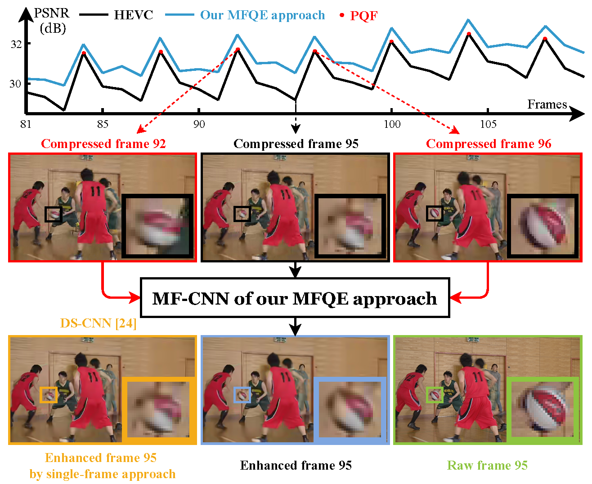

# MFQE 2.0: A New Approach for Multi-frame Quality Enhancement on Compressed Video (TPAMI 2019)

- [MFQE 2.0: A New Approach for Multi-frame Quality Enhancement on Compressed Video (TPAMI 2019)](#mfqe-20-a-new-approach-for-multi-frame-quality-enhancement-on-compressed-video-tpami-2019)
  - [Paper](#paper)
  - [Environment](#environment)
  - [Dataset](#dataset)
  - [Video compression](#video-compression)
  - [Test](#test)
  - [Training](#training)
  - [Others](#others)
    - [PQF enhancement](#pqf-enhancement)
    - [PQF detection](#pqf-detection)
    - [Approximate QP label (Optional)](#approximate-qp-label-optional)
    - [Unqualified label](#unqualified-label)
    - [MF-CNN models](#mf-cnn-models)
    - [OOM](#oom)
    - [Scene switch](#scene-switch)
    - [Black frame](#black-frame)
    - [License](#license)

**Highlights**
- The first **multi-frame** quality enhancement approach for compressed videos.
- The first to consider and utilize the **quality fluctuation** feature of compressed videos.
- Enhance low-quality frames using **neighboring high-quality** frames.



## Paper

[[arXiv]](http://arxiv.org/abs/1902.09707) [[IEEE]](https://ieeexplore.ieee.org/document/8855019)

If you find this work helpful, you may cite (BibTeX):
```
@ARTICLE{MFQEv2,
author={Z. {Guan} and Q. {Xing} and M. {Xu} and R. {Yang} and T. {Liu} and Z. {Wang}},
journal={IEEE Transactions on Pattern Analysis and Machine Intelligence},
title={{MFQE} 2.0: A New Approach for Multi-frame Quality Enhancement on Compressed Video},
year={2019},
volume={},
number={},
pages={1-1},
keywords={Quality enhancement;compressed video;deep learning},
doi={10.1109/TPAMI.2019.2944806},
ISSN={},
month={},
}
```

## Environment

- Python 3.5
- TensorFlow 1.8 (1.13/14 is ok but with warnings)
- TFLearn
- Scikit-image (for calculating PSNR and SSIM)

## Dataset

We open-source our lossless video dataset, including 108 videos for training and 18 common test sequences (recommended by ITU-T) for test.

[[DropBox]](https://www.dropbox.com/sh/d04222pwk36n05b/AAC9SJ1QypPt79MVUZMosLk5a?dl=0)

(Chinese researchers: [[百度网盘]](https://pan.baidu.com/s/1WL1WxFeRtwOh3HevPqeuTw), 提取码: xuia)

## Video compression

We also provide video compression tools in the above links.

Take 18 test sequences as examples.

1. Unzip the `18_raw.zip` into `18_raw` folder. It contains 18 raw videos. 
2. Run: `run_1.bat` (Windows) or `run_1.sh` (Ubuntu).

Note: On Ubuntu system, first `chmod +x TAppEncoderStatic`.

Note: The video compression may be slow. You can divide the bat commands into a certain number of bat files, and run them in parallel.

## Test

1. Download the `data` and `model` folders at [Google Drive](https://drive.google.com/drive/folders/1L-d4ptHZWV_jLl6KGvY81CochKcoY4wj?usp=sharing) (Chinese researchers: [北航网盘](https://bhpan.buaa.edu.cn:443/link/0EBF3709E3168E9A78206391258715A3)).
2. Put your test videos at `data/test/raw` and `data/test/compressed`. All videos in `data/test/compressed` will be enhanced one by one.
3. Change information in `main_test.py`, e.g., QP and GPU index.
4. Run `main_test.py`.

Note: Enhancing sequences *Traffic* and *PeopleOnStreet* may lead to OOM. See [OOM](#oom).

The average improved PSNR and improved SSIM results will be recorded in `out/record_test.txt`, which are the same as that in our paper:


## Training

We release our data processing and training code.

**Overview**

For non-PQF enhancement:
- `main_extract_TrainingSet_NP`
  - Obtain patch pairs (pre-PQF, mid-non-PQF and sub-PQF patch pairs) from videos.
  - Shuffle and stack these pairs into `.npy` files.
- `main_train_NP`: Train non-PQF enhancement model at QP=37 (training model at QP=37 may be easier than other QPs).
- `main_train_FineTune_NP`: Train non-PQF enhancement models at other QPs by fine-tuning QP=37 model.

For PQF enhancement:
- `main_extract_TrainingSet_P`
  - Obtain patch pairs (pre-PQF, mid-PQF and sub-PQF patch pairs) from videos.
  - Shuffle and stack these pairs into `.npy` files.
- `main_train_FinetuneFromStep1_P`: Train PQF enhancement models by fine-tuning non-PQF enhancement models at corresponding QPs.

You can also train your own model by fine-tuning the open-source pre-trained model.

Unfortunately, the above training codes are written in different times and devices. To run these code properly, you may have to change some paths.

## Others

### PQF enhancement

In MFQEv2, PQFs are also enhanced using its neighboring PQFs. In MFQEv1, PQFs are enhanced using a image enhancement approach.

Note that the models for PQF enhancement and non-PQF enhancement are trained separately.

### PQF detection

In the training stage, we use **ground truth PQF labels**, i.e., labels that generated by PSNR values. See our paper for more details.

In the testing stage, we provide PQF labels of all 18 videos in `data`. Besides, we have two more options for you:
1. Use **ground truth PQF labels** based on PSNR values. PSNR values can be simply obtained from either codecs or bit flow (e.g., log files generated by encoder include PSNR values). Also, we proved in our paper that the PSNR-generated label and detector-generated label have almost the same effect on the final enhancement performance.
2. Simply based on **QP values**. We find that among the 38 values, the QP value is of most importance. Therefore, one can also generate the PQF label according to the QP values. This option works especially for the LDP-encoded video. Note that: a low QP value usually indicates high image quality.

**Explanation**

In the testing stage, we use a Bi-LSTM based detector to generate PQF labels. It requires a 38-dimension vector as the input. In particular, 36 values are generated by a NR-IQA method, and the other 2 values are QP and bitrate values.

In other words, MFQE approach requires coding information (QP and bitrate), which can simply be extracted from the encoder log file (e.g., log.txt generated by HM16.5).

Specifically:
1. We first encode the raw video by HM16.5 codec, and thus obtain compressed video and its log file (includes QP, bitrate and also PSNR value of each frame).
2. We generate the 36 values by the open-source MATLAB code of the NR-IQA method adopted in our paper.
3. We extract the QP and bitrate values, and combine them with the above 36 values. This way, we obtain a 38-dim vector for each frame.
4. We feed all 38-value vectors of this video into the BiLSTM detector, and finally obtain the PQF label of this video.

As we can see, the whole process is a bit complicated:
- One can use various codecs, and then obtain various log files with different format.
- The data loading process can vary.
- The IQA method is based on MATLAB, which is hard to be transferred into Python code used by MFQEv2.

Therefore, we omit the compression, IQA and detection processes, but instead provide you with the pre-generated 18 PQF labels as well as two simpler options as mentioned above.

### Approximate QP label (Optional)

There may exist frames with different QPs in one video. You can prepare a `npy` file that **records the QP of each frame in one video**, and store it in folder `data/PQF_label` as  `ApprQP_VideoName.npy`.

Notice that we have only 5 models with QP22, 27, 32, 37, 42, so we should record the nearest QP for each frame. For example, if the QPs for 4 frames are: `21,28,25,33`, then we should record: `22,27,27,32`. That's why we call it "approximate QP label".

### Unqualified label

In our MFQE approach, each non-PQF should be enhanced with the help of its neighboring two PQFs (previous one + subsequent one).

Label 0 denotes non-PQF and label 1 denotes PQF. In some cases, the PQF label might be something like:
- 0 0 1 ... (The first 2 non-PQFs have no previous PQFs)
- ... 1 0 (The last non-PQF has no subsequent PQF)

Our solution: we simply let themselves to be the pre-PQF and sub-PQF, to manage the enhancement. The test code will automatically detect and fix this problem.

Similarly, the first PQF has no previous PQF, and the last PQF has no subsequent PQF. The first PQF serves as the previous PQF for itself, and the last PQF serves as the subsequent PQF for itself.

### MF-CNN models

There are two different models in `net_MFCNN.py`. `network2` is for QP = 22, 27, 32 and `network1` for QP = 37, 42. Correspondingly, there are two types of pre-trained model.

The performances of these two networks are close. Feel free to use them.

### OOM

Even with a 2080Ti GPU, we cannot process `2560x1600` frames (i.e., test sequences *Traffic* and *PeopleOnStreet*) directly.

We simply cut them into 4 patches for enhancement, combine the enhanced patches, and then calculate PSNR and SSIM.

For simplicity, the patching and combination processes are omitted in the test code.

### Scene switch

There may exist scene switch in one video. Frames in different scenes should not be fused and sent into MF-CNN.

In this case, we can use SSIM to detect scene switch, and then cut the video into a few clips.

Luckily, it seems that no scene switch exists in the 18 test sequences.

### Black frame

Enhancing black frames or other "plane" frames may lead to `PSNR=inf` result. Our solution:
1. If the middle frame is plane, skip it (do not enhance it). 
2. If the pre- or sub-PQF is plane, simply let the middle frame itself to be the pre-PQF and sub-PQF for enhancement.

### License

You can **use, redistribute, and adapt** the material for **non-commercial purposes**, as long as you give appropriate credit by **citing our paper** and **indicating any changes** that you've made.
