# 论文速览：*MFQE 2.0: A New Approach for Multi-frame Quality Enhancement on Compressed Video* (TPAMI 2019)

这篇论文是 *Multi-frame quality enhancement for compressed video*（CVPR 2018）的升级版，于 2019 年 9 月被 TPAMI 接收。

[[项目主页]](https://github.com/ryanxingql/mfqev2.0) [[论文]](https://arxiv.org/abs/1902.09707)

## 目录

- [论文速览：*MFQE 2.0: A New Approach for Multi-frame Quality Enhancement on Compressed Video* (TPAMI 2019)](#论文速览mfqe-20-a-new-approach-for-multi-frame-quality-enhancement-on-compressed-video-tpami-2019)
  - [目录](#目录)
  - [1. 要点](#1-要点)
  - [2. 压缩视频特性分析](#2-压缩视频特性分析)
    - [2.1 质量波动](#21-质量波动)
    - [2.2 帧间相关性](#22-帧间相关性)
  - [3. 方法](#3-方法)
    - [3.1 分类器](#31-分类器)
    - [3.2 好帧运动补偿](#32-好帧运动补偿)
    - [3.3 质量增强网络](#33-质量增强网络)
  - [4. 实验](#4-实验)
    - [4.1 差帧质量提升效果](#41-差帧质量提升效果)
    - [4.2 总体效果](#42-总体效果)
    - [4.3 缓和压缩视频的质量波动](#43-缓和压缩视频的质量波动)
    - [4.4 网络速度](#44-网络速度)
    - [4.5 主观效果](#45-主观效果)
  - [5. 其他](#5-其他)
  - [6. 我和这篇工作](#6-我和这篇工作)

## 1. 要点

本文提出了一种针对压缩视频的质量增强方法。创新点：

- 现有工作大多忽略了帧间相关性。本文利用了**视频的帧间相关性**。
- 我们应该是第一个考虑了**分层编码的压缩视频特性：质量波动**。
- MFQE 应该是第一个**运动补偿 + 质量增强**的 end-to-end 方法。
- 本文提出的方法，核心思想是**好帧补偿差帧**，是非常具有 insight 的方法。

我们看图说话：

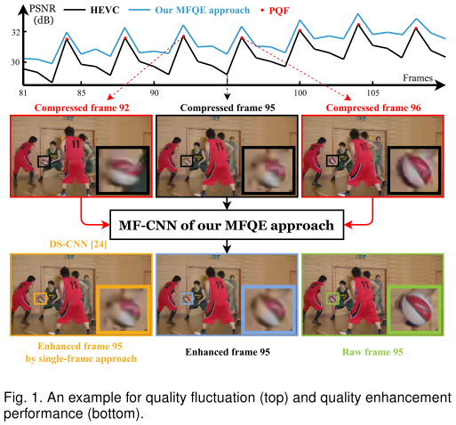

1. 如图上半部分黑线，压缩视频中存在显著的质量（本文考虑 PSNR）波动状况。其中，第 92 帧和第 96 帧达到了 PSNR 局部极大值点，中间的第 95 帧处在 PSNR 局部极小值点。
2. 如图下半部分，质量好帧——第 92 和 96 帧中的篮球比较清晰，而质量差帧——第 95 帧中的篮球质量很差（马赛克严重）。
3. 在我们的 MFQE 算法中，在增强第 95 帧时，92 帧和 96 帧的信息也会被参考，使得增强效果显著好于图像增强方法 DS-CNN（橙色框）。

## 2. 压缩视频特性分析

### 2.1 质量波动

首先，我们以压缩视频库中的 6 个视频为例，看一看质量波动性：

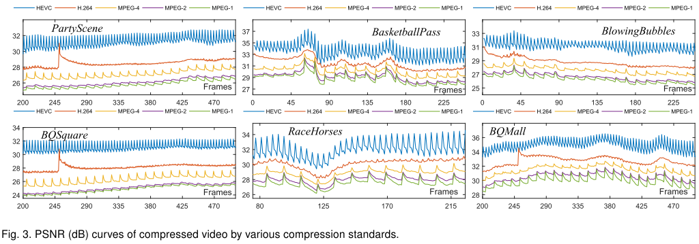

可见，无论是 HEVC、H264 还是 MPEG-1/2/4，这种质量波动性都是存在的，并且在 HEVC 中尤为明显。本文以 HEVC 为主要分析对象。

进一步，我们对这种质量波动性进行量化。我们衡量两个指标：

1. 相邻的好帧和差帧的 PSNR 差值。差值越大，说明局部质量波动越厉害。这就是所谓的峰值 - 谷值差值（Peak-Valley Difference, PVD）。
2. 整个视频 PSNR 的标准差。标准差越大，说明该视频的 PSNR 越不稳定，即全局质量波动越厉害。这就是文中的 SD。

我们在整个视频库（108 个视频）中统计了上述两个指标的平均值，结果如表：

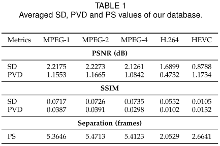

质量波动性有两点意义：

1. PVD 大，说明好帧、差帧质量差距大，说明**差帧借助好帧提升质量的潜力很大**。
2. SD 大，说明好帧补偿差帧的方法非常适用于压缩视频。

### 2.2 帧间相关性

进一步，我们得看看好帧补偿差帧是否可行。我们测量了相邻若干帧的两帧之间的相关系数及其标准差，如图：

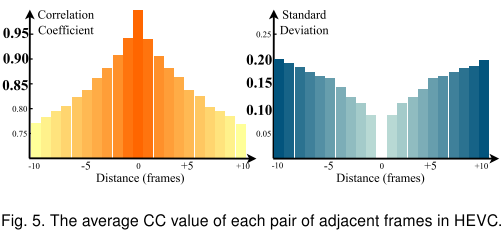

结果说明：

1. 时序相关性很强：前后距离 10 帧内，平均相关系数都能超过 0.75。
2. 时序相关性保持较稳定：标准差较小。

那么，压缩视频中好帧（局部质量峰值）之间的平均距离大概是多少呢？我们在上一个表格中展示了 PS 这个指标，在 HEVC 大概是 2.66。好帧之间的距离如此近，结合上图可知，**两个相邻好帧和其间差帧之间的相关性极高**。

总之，我们的思想是有前景的！

## 3. 方法

我们的 MFQE 方法由一个框图说明：

1. 首先，我们用一个分类器，将视频中的好帧（质量局部极大值）找出来。
2. 对于每一个差帧（只要不是局部极大值，就算差帧），借助其相邻的两个好帧，我们进行质量增强。
3. 在质量增强之前，这两个好帧要进行运动补偿，补偿到差帧所处时刻的状态。
4. 好帧也进行同样的流程，此时好帧借助的是相邻好帧。

批注：MFQEv1 对于好帧的增强采用的是**图像**增强方法 DS-CNN。这里好帧也用相邻好帧进行增强，得到了审稿人好评，因为网络得到了统一和简化。

### 3.1 分类器

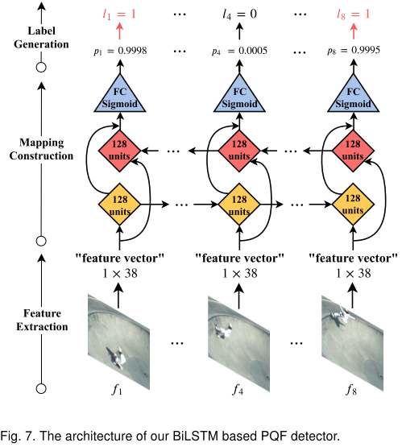

分类器用 Bi-LSTM 搭建。对于每一帧，我们都采用参考文献\[2\]提供的质量评估方法，得到一个 36 维的向量；然后我们再添加这一帧的比特率和 QP（这些都可以从码流中轻易获得），得到一个 38 维的向量，表征这一帧，输入 Bi-LSTM 网络。

理想状况下，Bi-LSTM 能够通过比较这些特征向量，找出局部质量极大值点。

要注意，这是一个无参考的分类器：即不需要原始无损视频信息，不需要 PSNR 信息，而是通过传统的质量评估方法获得的“特征向量”，再进行学习。

MFQEv1 中的分类器采用的是 SVM。这里用 Bi-LSTM，极大提升了分类准确率，并且降低了分类难度，提升了分类速度。

### 3.2 好帧运动补偿

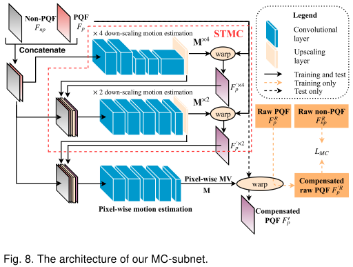

为了让整体网络可以端到端训练，这里的运动补偿网络采用的是基于 CNN 的光流预测网络\[29\]。

### 3.3 质量增强网络

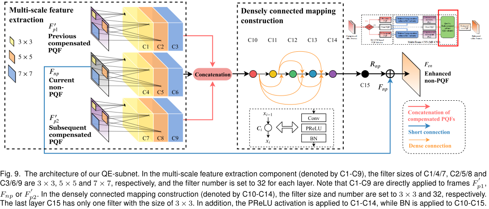

运动补偿后的好帧，与差帧一起输入网络。在前端，我们采用了三种 scale 的特征提取；在后端，我们采用了稠密连接和 BN 技巧。整体上，我们还采用了短连接。

在 MFQEv1 中，质量增强网络采用的是渐进融合设计，效果差得多，参数量也大得多（5 倍以上）。

## 4. 实验

### 4.1 差帧质量提升效果

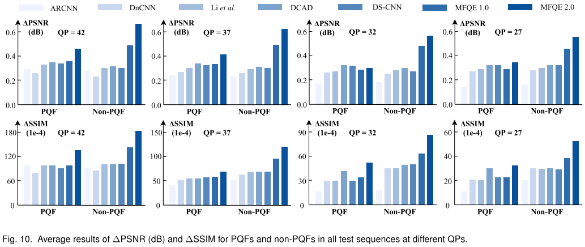

好帧在文中就是 PQF，差帧就是 non-PQF。如图，MFQEv2 算法在好帧增强上略高于其他算法，但**在差帧增强方面显著高于其他算法**。这就体现了 MFQEv2 的优势。

### 4.2 总体效果

我们以 PSNR 的增强数据为标准。如大表格：

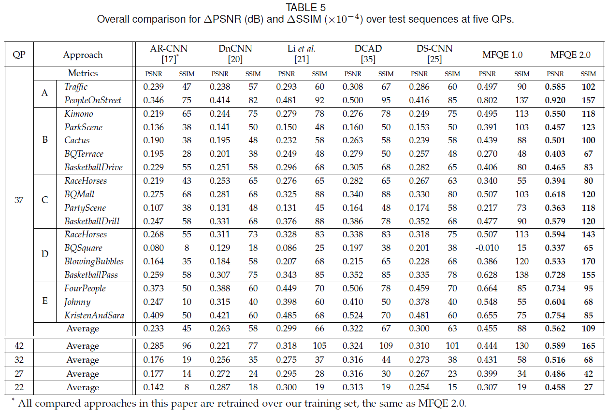

在国际标准测试序列（18 个视频）上，MFQEv2 全面胜出，展现出较好的泛化能力。

编码领域通常还衡量 BDBR 指标。我们看看结果：

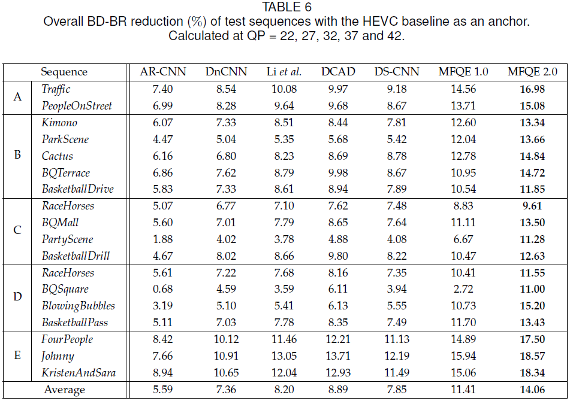

图像方法最多能到 9%，而 MFQE 方法能达到 14%。

### 4.3 缓和压缩视频的质量波动

由于 MFQEv2 对差帧的提升非常显著，因此可以缓和质量波动现象。我们通过 SD 和 PVD 的下降程度来验证这一点：

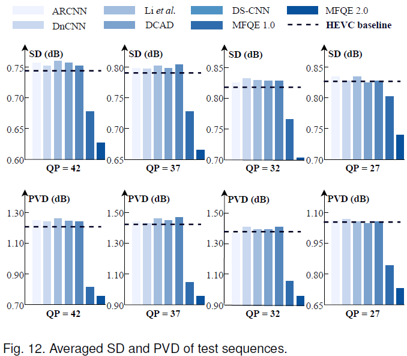

如图，PSNR 的标准差显著下降，而峰值 - 谷值差距减小，说明质量波动下降明显。此外，我们以两个视频的 PSNR 曲线举例说明：

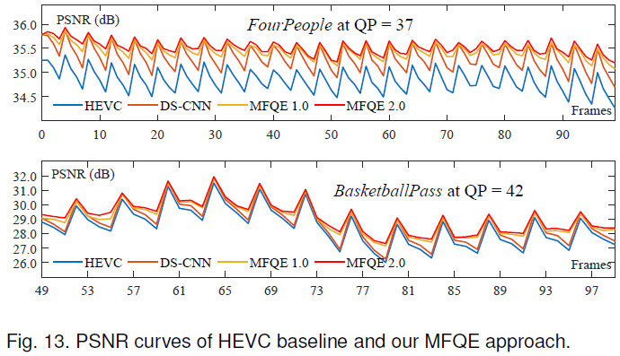

显然，MFQEv2 增强后，PSNR 曲线最为平滑。

### 4.4 网络速度

MFQEv2 不仅效果好，而且参数少、帧速率快。这进一步说明了多帧方法的优势：我们不需要冗余的网络，多帧信息是我们的杀手锏。

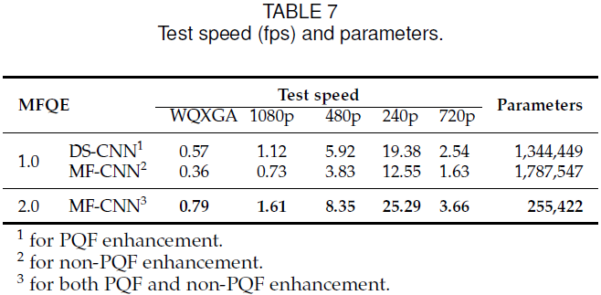

如图，其中 DS-CNN 就是 SOTA 的单帧方法。

### 4.5 主观效果

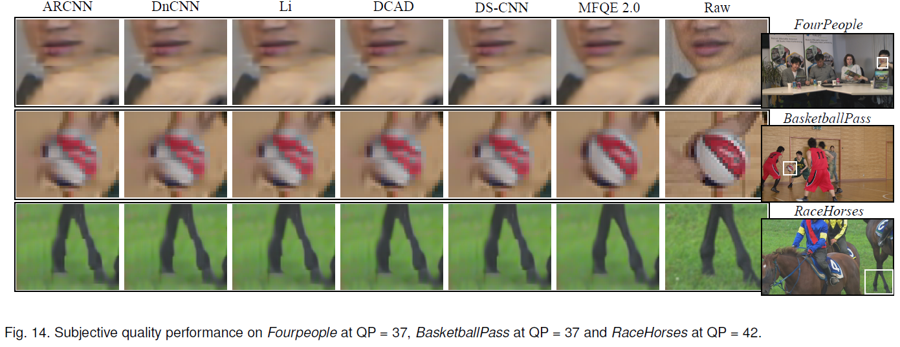

## 5. 其他

MFQE 思想是有实际意义的。根据实验，简单的【相邻帧补偿】或【差帧补偿好帧】，效果都不很理想。所以【好帧补偿坏帧】是本文 MFQE 框架成功的关键。

关于复现：

- 论文中提到用 raw 帧训练 MC-subnet；实际上，开源代码和论文的结果都是直接用压缩帧训练 MC-subnet 的。这样有两个优点：（1）简单；（2）个人认为效果可能更好，因为训练、测试阶段都使用压缩帧，模式匹配。关于这一点没有及时更正论文，非常抱歉。
- MFQE 算法依赖于较为精确的运动建模（光流预测）。如果运动补偿不准确，那么总体效果可能不理想。
  - 已经有一些方法跳过了运动建模，例如使用 conv-LSTM 直接输入相邻帧（我认为有利有弊：隐式地建模运动，虽然简单，但增强性能可能下降）。
  - 还有一些其他的 alignment 方法，例如 feature-wise 而不是 frame-wise 执行 alignment，参考本人复现的 [STDF（AAAI 2020）](https://github.com/ryanxingql/stdf-pytorch)工作。
- 我们只考虑了 PSNR 指标，因此在主观效果上表现一般。从 MFQE 以后我也在转向对感知质量的研究。
- 在一些规律较强的编码模式，例如 CQP 模式下，建议使用简单的 QP 波动生成 PQF label。
  - 实验发现，CQP 模式下，用 PSNR 或 QP 波动定义的 PQF label 基本一致。
  - QP 在解码 log 文件中可得，在实际条件下比 PSNR 更容易获取。
- 在实验条件下，可以用 PSNR label 代替预测的 PQF label。
  - 根据我们的溶解实验，【预测生成的 PQF label】和【真实 PSNR 生成的 PQF label】对应的增强性能基本一致。
- MFQE 不好训练；建议采用更健壮的大型网络，搭配 MFQE 思想降低参数量
  - MFQEv2 没有使用任何“花哨”的结构设计和训练技巧，而是用最简单的结构，实现了 MFQE 思路。好处是，网络参数量仅 255k；坏处是，网络训练对初始化、数据库等非常敏感。
  - 建议大家在使用 MFQE 思想的情况下，选择更大、更健壮的网络。
  - 在训练时，第一阶段【运动补偿网络收敛】比较缓慢，可能在前 8 个 epoch 的 dpsnr 都在 0 dB 左右。因为在第一阶段，我们的重点是 MC 网络，QE 网络没有收敛。
- 小心场景切换
  - 在补偿时要注意：输入的三帧必须在同一场景下。一个视频中可能存在场景切换。可以用 SSIM 等指标检测切换。

更多复现指南及开源视频数据库，请参见 [MFQEv2 代码仓库](https://github.com/ryanxingql/mfqev2.0)。

## 6. 我和这篇工作

2018 年 9 月保完研，我第一次走进 MC2 实验室。当时的我对视频编码、质量增强、深度学习等一窍不通，只学过吴恩达的机器学习慕课。

从 2018 年 9 月 到 2019 年 2 月，我坐在实验室工位上，看了整整半年书，逐渐入门了视频编码、深度学习和 TensorFlow。与此同时，徐迈导师安排我从事实验室课题之一：质量增强，并让我接手杨韧师兄的 CVPR'18 的升级工作。当时的 MFQEv1 模型有待提升；在 18 个标准测试视频上，MFQEv1 仅在 8 个视频上表现尚可，在其余 10 个视频上表现都很一般。经过半年的疯狂试验和探索，最终 MFQEv1 模型进化为 MFQEv2：参数更少，跑的更快，增强性能更佳。在这期间，我对所学知识的理解也有了质变：实践加速了我对新知识的掌握。我还特别喜欢写博客，这对我学习新知识是一种激励。经过半年的锻炼以后，我对基础知识和编程技术细节都能略讲一二了。

在 19 年过年前，初生牛犊不怕虎，我和徐老师拍板，决定把工作投至 TPAMI。半年后审稿意见回来，一致要求大修，并且都给出了非常积极的提升建议。徐老师告诉我，如果建议很难实现，我可以不予采纳，因为这些只是建议不是意见。但我想了想，决定实现审稿人提出的建议，并在两个月后大获成功；这些改进不仅让模型得到了精简（统一了 PQF 和 NP 的增强模型架构），而且还赢得了审稿人的好评，因而在第二轮审稿时论文被直接接收。此时是 19 年 9 月 26 日的夜晚；第一次投稿，第一次尝试顶刊，就中了，似乎顶刊不过如此；但我也深知，我所做的工作只是简单的工程实践，我的目标是星辰大海。

这一篇工作，是我作为入门练手称得上成功的作品。它真真切切地锻炼了我的编程能力，也让我对这个领域有了相当的认识。在亲身挑战的过程中，我不仅感受到了 MFQE 方法的魅力，也直面了许多缺陷和不足；例如 MFQE 方法非常依赖准确的光流建模；例如 MFQE 方法需要训练多个模型，比较繁琐。对于前者，我在一年后利用基于特征层融合的 STDF 方法予以解决；对于后者，我通过 ECCV 20' 的工作 RBQE 予以解决。
